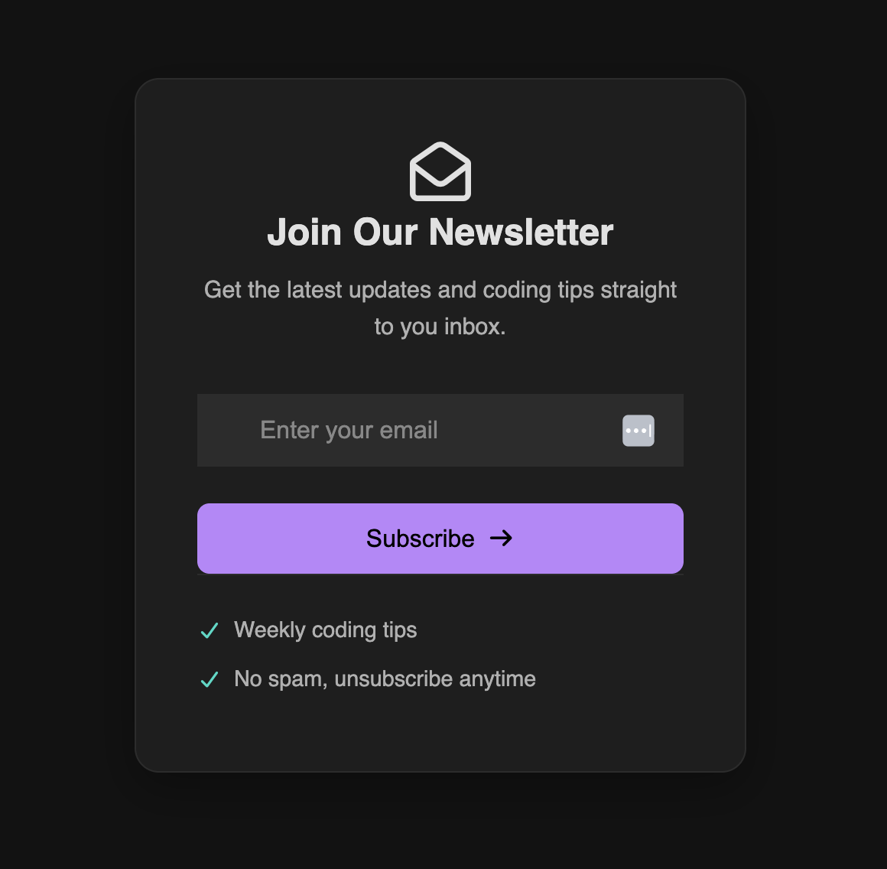

# Newsletter Email Opt-in Form

A beautiful, dark-themed newsletter signup component with a modern design. Perfect for capturing email subscriptions with style.

---

## 🖼️ Screenshot



---

## ⚡ Key Features

- **🎨 Dark Modern Design** - Sleek black background with purple gradient accents
- **📱 Fully Responsive** - Works perfectly on mobile, tablet, and desktop
- **✉️ Email Validation** - Built-in HTML5 email validation
- **🎯 Clear Call-to-Action** - Prominent purple subscribe button
- **✅ Value Indicators** - Checkmarks showing key benefits
- **🎭 Font Awesome Icons** - Professional icon integration
- **⚡ Fast & Lightweight** - Pure HTML/CSS, no frameworks needed

---

## 🚀 Quick Start

1. Download the files
2. Open `optin.html` in your browser
3. That's it! No installation or build process required.

```bash
# Optional: Run with a local server
python -m http.server 8000
```

---

## 📦 What's Included

```
newsletter-optin/
│
├── optin.html          # Main HTML file
├── style.css           # All styling
└── README.md           # This file
```

---

## 🎨 Design Highlights

### Colors
- **Background:** Deep black (#0a0a0a)
- **Container:** Dark gray (#1a1a1a)  
- **Button:** Purple gradient (#b794f6 → #a78bfa)
- **Checkmarks:** Cyan (#22d3ee)
- **Text:** White & light gray

### Layout
- Centered card design with rounded corners
- Stacked form (input above button for better mobile UX)
- Smooth hover animations
- Clean, minimal spacing

---

## 💻 Technologies

- HTML5
- CSS3 (Flexbox, Custom Properties)
- Font Awesome 7.0.1 (CDN)

---

## ✏️ Customization

### Change Button Color
Find this in `style.css`:
```css
button {
    background: linear-gradient(135deg, #b794f6 0%, #a78bfa 100%);
}
```

### Update Text
Edit `optin.html`:
- Line 22: Headline "Join Our Newsletter"
- Line 23: Description text
- Lines 34-35: Benefit items

### Adjust Size
```css
.signup-container {
    max-width: 450px;  /* Change container width */
    padding: 3rem;     /* Change internal spacing */
}
```

---

## 🌐 Browser Support

✅ Chrome, Firefox, Safari, Edge (latest versions)  
✅ Mobile browsers (iOS & Android)


---

## 🎯 Perfect For

- Tech blogs and coding tutorials
- SaaS landing pages
- Developer portfolios
- Newsletter subscription pages
- Marketing campaigns

---

## 📄 License

Free to use for personal and commercial projects.

---

## 💡 Tips

- The form uses `required` attribute for email validation
- Currently frontend only - add backend to actually capture emails
- Consider connecting to Mailchimp, ConvertKit, or your email service
- Add GDPR compliance checkbox if targeting EU users

---

**Made with ❤️ | Feel free to customize and use in your projects**